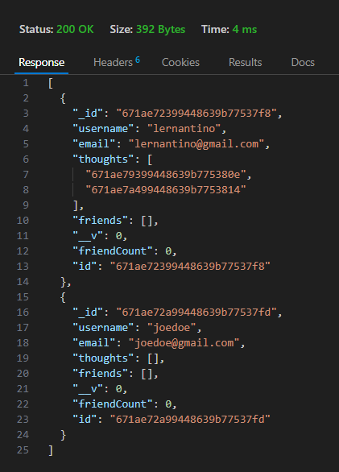

# Social Network API

## Description

This project is an API built from scratch for a social network web application where users can share their thoughts, react to friends' thoughts, and create a friend list. It was developed using **Express.js** for routing, a **MongoDB** database, and the **Mongoose** ODM.

## Table of Contents

- [Installation](#installation)
- [Usage](#usage)
- [Contributing](#contributing)
- [Testing](#testing)
- [Links](#links)

## Installation

To get started with this application, follow these steps:

1. **Clone the Repository**  
   Visit the [GitHub Repository](https://github.com/dolaes/Social-Network-API) and clone/download the project:
   
   ```bash
   git clone https://github.com/dolaes/Social-Network-API.git
   ```

2. **Install Dependencies**  
   Navigate to the project directory and run the following command to install dependencies:
   
   ```bash
   npm install
   ```

## Usage

Once the dependencies are installed, start the server locally by running:

```bash
npm run start
```

You can interact with the API using tools such as **Thunder Client** or **Insomnia** to make API calls for viewing, creating, updating, and deleting users, thoughts, and reactions.

**Watch the Demo Video**:  
Click the image below to see a demo of the application:

[](https://drive.google.com/file/d/1HxPgCbf1LN6Tur4GexYJ9DsP5ycJTiU1/view?usp=sharing)

## Contributing

Developed by:  
- Daniel Olaes

Starter code provided by UCI Software Engineering Boot Camp.

## Testing

Ensure that the API calls return the correct statuses and responses. Verify that each change is reflected in the local database by making **GET** requests to view specific data.

## Links

- **GitHub Repository**: [https://github.com/dolaes/Social-Network-API](https://github.com/dolaes/Social-Network-API)
